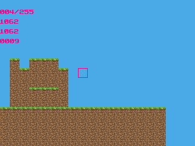

# Tijd (WIP)

Tijd is a 2D sandbox game with idle progression inspired by [Blockheads](https://theblockheads.net/). You instruct your bots, and they do the work. Even if you're gone for some time.

## Highlights
- Foreground and cascading background layer for blocks
- Chunks aren't saved unless they are modified to save memory
- (TODO) Tasks with time tracking
- (TODO) Procedural world generation
- (TODO) Automatic pathfinding
- (TODO) Original art